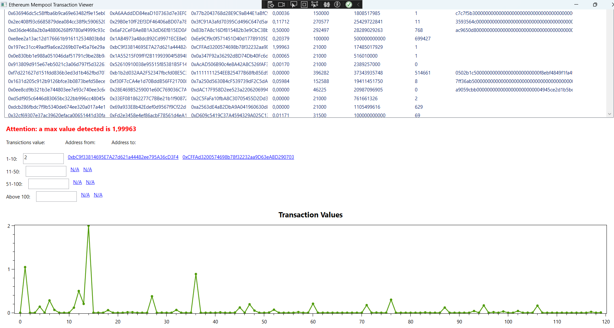

# Ethereum Mempool Transaction Viewer

## Project Overview

This is a WPF application developed using C# that allows users to monitor Ethereum transactions in real-time using Synternet's SDK in C# and their streams. The main goal of the project is to display Ethereum mempool transactions, organize them by value range, see the graphic of values, and provide interactive features like opening addresses in Etherscan.

### Key Features:
1. **Real-time Data**: Fetches Ethereum transactions and displays them in a structured list.
2. **Value Grouping**: Categorizes transactions based on value ranges: 1-10, 11-50, 51-100, and above 100. An alarm sound every time it is detected.
3. **Transaction Details**: Displays key transaction details like sender/recipient addresses, gas, gas price, and nonce.
4. **Visual Plot**: Graphs transaction values over time for quick visualization.
5. **Interactive**: Users can click on addresses to view details in a browser via Etherscan.
6. **Alerts**: When a transaction exceeds the previously detected maximum value, the system triggers an alert.

## Project Architecture

This project leverages multiple technologies:

1. **C# WPF**: For building the UI and handling user interactions.
2. **NATS Provider SDK**: Used to connect to the Synternet Ethereum Mempool Stream.
3. **OxyPlot**: For graphical display of transaction values.
4. **JSON Parsing**: Using Newtonsoft.Json for parsing the incoming transaction data.
5. **Dispatcher Timer**: To fetch and refresh data every second, ensuring real-time updates.
6. **MediaPlayer**: Alarm sound every time it is detected a particular transiction

## Setup and Installation

### Prerequisites for launch the application from executable:
- Open folder WpfApp1\bin\Debug\net7.0-windows
- Double click on EthMempool.exe (if accessToken, natsUrl, streamName are configurated). For configurated them, in the `MainWindow.xaml.cs` file, replace the placeholder variables in the method setAttributesForNatsProvider() for:
    - `accessToken`
    - `natsUrl`
    - `streamName`

### Prerequisites for launch the application viewing the code:

- Visual Studio or another C# IDE
- NATS Provider SDK
- Internet access to connect to Synternet NATS broker

### Installation Steps:

1. **Clone the Repository**:
    ```bash
    git clone https://github.com/FabrolIsBack/Synternet_EthMempoolViewer.git
    ```

2. **Open the Project in Visual Studio**:
    Open the `.csproj` file located in the pubsub-Csharp-main directory with Visual Studio or another IDE that supports C#.

3. **Install Required NuGet Packages**:
    Ensure that the following NuGet packages are installed:
    - Newtonsoft.Json
    - OxyPlot.Wpf
    - NATSProvider (SDK from Synternet)

4. **Configure the Application**:
    In the `MainWindow.xaml.cs` file, replace the placeholder variables in the method setAttributesForNatsProvider() for:
    - `accessToken`
    - `natsUrl`
    - `streamName`
    
    with your own credentials and stream information for the NATS provider.

5. **Build and Run**:
    Build the project using `CTRL+SHIFT+B` or via the Visual Studio build menu.
    Run the project using `F5` or through the Visual Studio menu.

## Usage

1. **Viewing Transactions**:
   - The application automatically connects to the Synternet Ethereum mempool and fetches transactions in real-time.
   - Transactions are categorized into value ranges and updated in the list.
   - Click on any transaction address to open it in the default browser using Etherscan.

2. **Graph View**:
   - The bottom of the application shows a graph of the transaction values over time, making it easy to identify trends or outliers.
   
3. **Sound Alerts**:
   - When a transition increments the counter, an alarm sound is played (ensure system sound is enabled).

## Testing

### How to Test:
- The application fetches live Ethereum transaction data, but to test locally:
    - Modify the `LoadData()` method to simulate transactions.
    - Use mock JSON data to simulate a series of Ethereum transactions.
    
### Expected Results:
- Transaction details should populate the list.
- Transaction counts in each value range should increment correctly.
- The highest transaction should trigger a red alert message in the UI.
- You can click to the address for open etherscan

<br> <br>
The graph is displayed with the Eth present in the transitions and the counters to differentiate them based on the amount:<br>


<br><br>


<br><br>



<br><br>

Example with pending transaction


<br><br>

Example:
A transaction of 172 eth is displayed, clicking on the source address shows that they are being delivered to a Binance address: <br>


<br><br>

ExampleChart:


ExampleCounters:


## License
 
This project is licensed under the MIT License.
